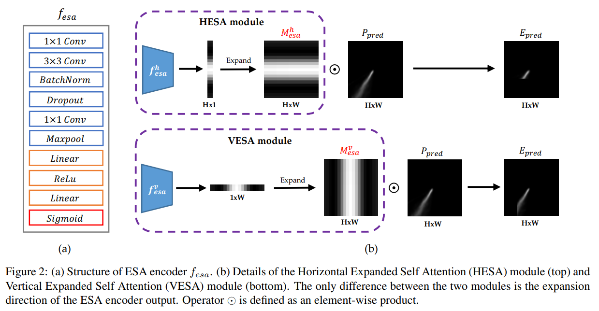
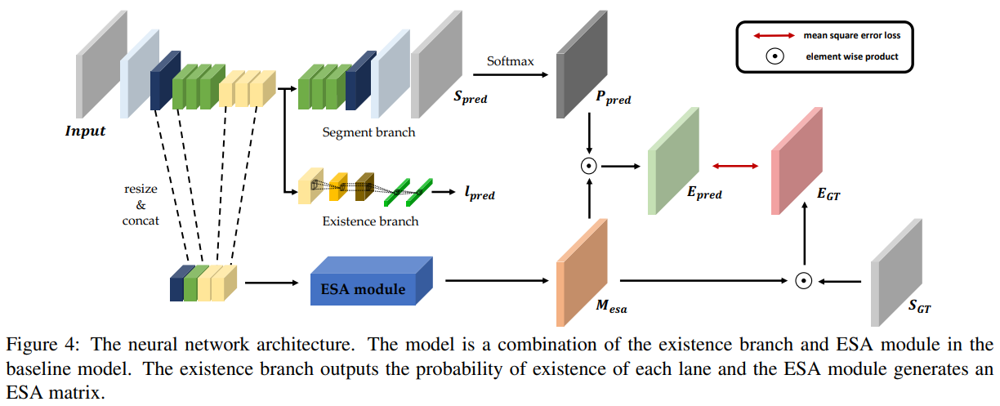
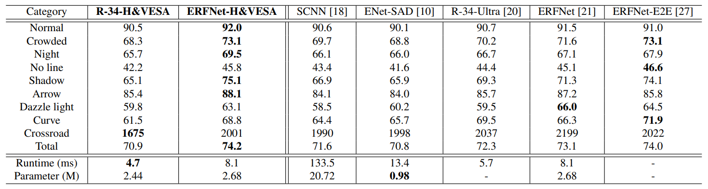

# Robust Lane Detection via Expanded Self Attention (WACV 2022)
[Minhyeok Lee](https://github.com/Hydragon516), [Junhyeop Lee](https://github.com/JunhyeopLee), [Dogyoon Lee](https://github.com/dogyoonlee), Woojin Kim, Sangwon Hwang, Sangyoun Lee

## Overview
This repository is the official PyTorch implementation of Robust Lane Detection via Expanded Self Attention (WACV 2022).
Our paper can be found [here](https://arxiv.org/abs/2102.07037).

## Benchmark Results
[](https://paperswithcode.com/sota/lane-detection-on-culane?p=robust-lane-detection-via-expanded-self)

## Architecture



## Results (CULane)


## Dataset
Download the CULane dataset [here](https://drive.google.com/drive/folders/1mSLgwVTiaUMAb4AVOWwlCD5JcWdrwpvu).

```
└── Dataset root/
    ├── annotations_new
    ├── driver_23_30frame
    ├── driver_37_30frame
    ├── driver_100_30frame
    ├── driver_161_90frame
    ├── driver_182_30frame
    ├── driver_193_90frame
    ├── laneseg_label_w16
    ├── laneseg_label_w16_test
    └── list/
        ├── test_split/
        │   ├── test0_normal.txt
        │   ├── test1_crowd.txt
        │   └── ...
        ├── test.txt
        ├── test_gt.txt
        ├── train.txt
        ├── train_gt.txt
        ├── val.txt
        └── val_gt.txt
```

## Training
Edit the [config.py](https://github.com/Hydragon516/ESA-official/blob/main/configs/configs.py) before training.
Then start training with the following:
```console
python train_mymodel.py
```

## Testing
We provide test code for lane prediction visualization.
Modify the best model in [config.py](https://github.com/Hydragon516/ESA-official/blob/main/configs/configs.py)
Then start testing with the following:
```console
python test.py
```
