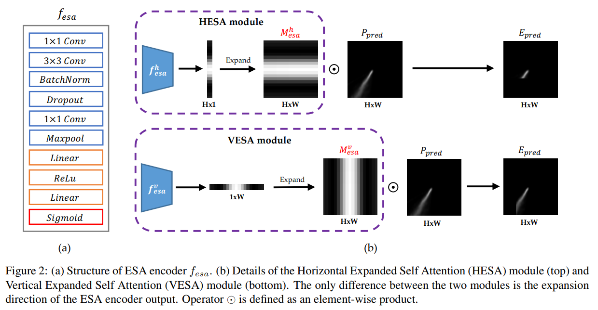
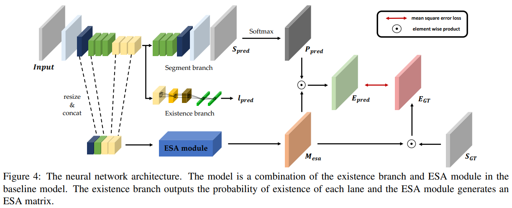

# Robust Lane Detection via Expanded Self Attention (WACV 2022)
Minhyeok Lee, Junhyeop Lee, Dogyoon Lee, Woojin Kim, Sangwon Hwang, Sangyoun Lee

## Overview
This repository is the official PyTorch implementation of Robust Lane Detection via Expanded Self Attention (WACV 2022).
Our paper can be found [here](https://arxiv.org/abs/2102.07037).

## Architecture

